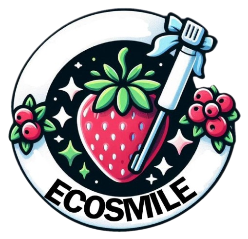

  
  
  
  

# 👋 &nbsp;Buenass!

Hola! Soy un desarollador Colombiano con vias a bioingenieria. Me encanta aprender de diferentes lenguajes de programacion y suelo ser bastante versatil a la hora de trabajar frontend o backend. 
Si deseas ver mas detalles sobre lo que soy capaz de hacer, visita mi [curriculum](https://santiag0jaja.github.io/Curriculum) (pagina web realizada por mi mismo).

&nbsp;

## 👇 &nbsp;Proyectos recientes

Actualmente estoy tabajando en [Ecosmile](https://santiag0jaja.github.io/Ecosmile). Una pagina web que proximamente sera una aplicacion capaz de generar pedidod del producto y tener un backend más poderoso.
  

  
  

&nbsp;

## 🧰 &nbsp;Habilidades

  
  
  
  
  
  
  

&nbsp;

## 🖥 &nbsp;Otros proyectos destacados

 &nbsp; 

&nbsp;

## 📊 &nbsp;Stats

---

